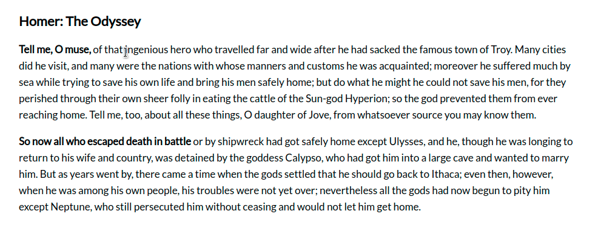

# Recogito Connections

A plugin to enable drawing of connections between annotations.



## Usage

Import via __script__ tag:

```html
<script src="https://cdn.jsdelivr.net/npm/@recogito/recogito-connections@latest/dist/recogito-connections.js"></script>
```

```js
window.onload = function() {
  var r = Recogito.init({
    content: 'content'
  });

  var connections = recogito.Connections(r);

  // Load highlights and connections
  r.loadAnnotation('annotations.w3c.json');

  connections.on('createConnection', function(c) {
    console.log('created', c);
  });
  
  connections.on('updateConnection', function(updated, previous) {
    console.log('updated', updated, previous);
  });

  connections.on('deleteConnection', function(c) {
    console.log('deleted', c);
  });
};
```

## Annotation Format

Connections are represented as standard web annotations. The difference to text highlights is that
the `target` property of connection annotations points to the IDs of the two annotations it connects.
Example:

```json
{
  "@context": "http://www.w3.org/ns/anno.jsonld",
  "type": "Annotation",
  "id": "#connection-1",
  "body": [],
  "target": [
    { "id": "#highlight-1" },
    { "id": "#highlight-2" }
  ]
}
```

## Development

```sh
$ npm install
$ npm start
```